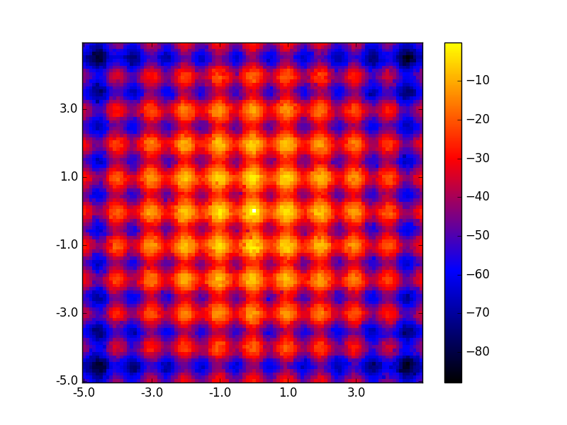
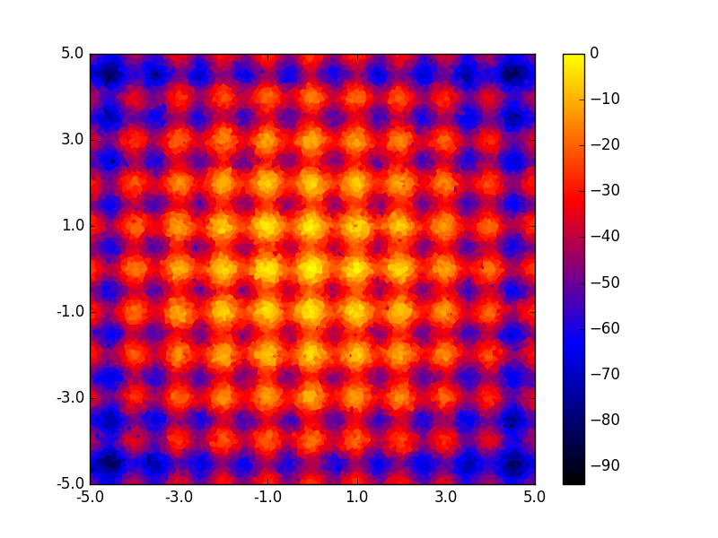

# Centroidal Voronoi Tesselation MAP-Elites

CVT-MAP-Elites experimental module for Sferes2.

## Authors:
- Vassilis Vassiliades (vassilis.vassiliades@inria.fr)

## Description

Centroidal Voronoi Tesselation MAP-Elites is a natural extension of MAP-Elites to handle high dimensional behavior spaces.
The number of niches in MAP-Elites is dependent on the dimensionality of the problem and the discretizations used.
In CVT-MAP-Elites, the number of niches is set before-hand. The location of these niches is determined in a way that the behavior space is partitioned into equisized regions. This is done using a centroidal Voronoi tesselation (https://en.wikipedia.org/wiki/Centroidal_Voronoi_tessellation). New points fall into the region of the closest centroid.

## Example on Rastrigin function:

- MAP-Elites

- CVT-MAP-Elites

